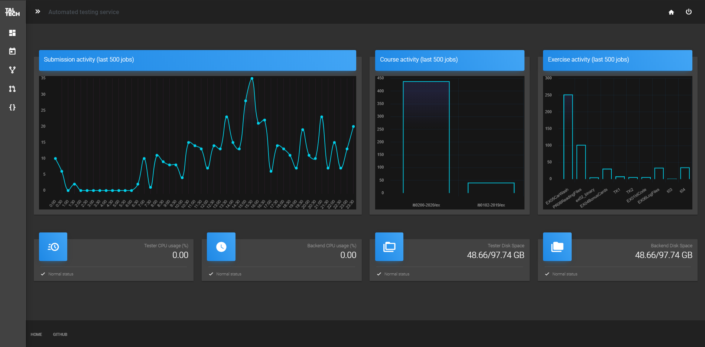

# Arete admin panel

On dashboard you can see the current state of backend and tester

On submissions page you can:
* Force tester to pull a new image from docker.io repository to run tests on.
* Force tester to pull new tests from git repository to run tests with.
* Create a submission to test whether tester is working or not.
* See currently active submissions.
* See last 500 submissions ran and their details on how the testing went and what were the results.

On courses page you can:
* See what course is currently active.
* On what times it is currently active.
* What errors are the most common.
* How's the code style
* Students taking the course and their:
    * Student's activity regarding the course
    * Student's diagnostic errors regarding the course
    * Student's code errors regarding the course
* Students compared to each other regarding the course

(Fun fact. Spike on the submission graph was from stress testing the system.)

Then there is also a exercise page, what is really similar to courses page, but replace every word 'course' with 'exercise'.

And finally there is students page, what accounts every student activity and compares them.

Workflow is available at (last element): https://xd.adobe.com/view/e9f19aac-b44f-4a2b-6444-cd167366b51c-9fc0/grid/

Demo is available: https://xd.adobe.com/view/e9f19aac-b44f-4a2b-6444-cd167366b51c-9fc0/?fullscreen

Feedback on the wireframe by 2 students whos opinnion was accounted for and new wireframe was made: https://xd.adobe.com/view/7708ba44-696e-4617-7d76-f24ff837b634-0139/
